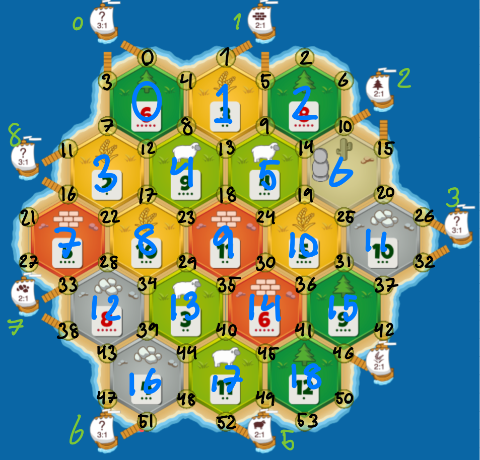

# CatanAnalysis
This repository is my personal tracking of played catan games on colonist.io. Currently i am manually entering all information into the DB after each game. The purpose of this repository is to contribute with a dataset of catan games containing features to fully describe a game and end-game statistics.
(This is currently WIP) 
## CatanDB
Here is an explanation of each feature in the dataset:
* **Map string** - A string representing the map of the board. Each tiles is represented by the two first letters of the resource name (eg. wh, sh, wo, or, br) followed by the die number. The ordering is row by row, top to bottom, going left to right. (Shown in below picture)
* **Port string** - Port is indicated by first two letters of resource (eg. wh,sh,wo,or,br) and xx for 3:1 port. Ordering starts from top left port and goes clockwise (Shown in below picture)
* **PlayerPlacement** - Each tile is given a number. The ordering is row by row, top to bottom going left to right. Format of this is first "placement, second placement". A placement is denoted by "tile position"-"position-of-tile-road-points-to" 
* **Player points**	- Indicates player points from first to fourth player
* **PointsFromSettlements**	- Indicates player points from first to fourth player
* **Points from cities** - Indicates points from cities from first to fourth player
* **Points from VP cards** - Indicates points from VP cards from first to fourth player
* **PlayerWithLargestArmy**	- Indicates which player had largest army at the end of game. 0 means no player had largest army
* **PlayerWithLongestRoad**	- Indicates which player had longest road at the end of game. 0 means no player had largest army
* **DiceStats** - Dice stats indicates amount of times each number of eyes rolled. Ordering goes from 2-12
* **ResourceCardsDrawn** - Indicats number of resources drawn throughout the game. Ordering is wood, brick, sheep, wheat, ore
* **ActivityStats** - The indicies in this array has the following order:
* * Total times proposed to trade,
* * Total successful trades with opponents,
* * Amount of resources used,
* * Amount of ressource income blocked,
* * Amount of dev cards bought,
* * Amount of dev cards used
* **ResourceStats** - The indicies in this array has the following order: 
* * Total ressource income
* * Total ressource loss
* * Total ressource score
* * Resouce gained by rolling dice
* * Ressource gained by robbing
* * Ressource gained by using dev cards
* * Ressource gained by trading
* * Ressource lost by rolling 7
* * Ressource lost by getting robbed
* * Ressource lost by dev cards
* * Ressource lost by trading
* * Ressource gained by gold tiles (Not used in original game)

For the ResourceStats and ActivityStats these values exists for each player in the dataset.

